# Price is Right 💰

**Price is Right** is a fine-tuning capstone project that explores how **frontier models and traditional machine learning models** can predict the price of a product from its description.

Five step strategy to select,training, and applying an LLM to a commercial problem:

**Understand the problem → Prepare: clean, pre-process → Select right model→ Customize that model:Prompts, Rag, Agents, Fine tuning  → Productionization**

The ultimate goal is to incorporate the price prediction capability into an **agentic solution that can identify and evaluate potential bargains**.

---

##  Project Overview

> **Given a description of a product, predict the true value of the product.**

The project uses product data from the **McAuley Lab Amazon Reviews 2023 dataset**, accessed through Hugging Face.

The workflow begins by investigating and understanding the raw data, followed by parsing, visualization, data-quality analysis, curation, preprocessing, and dataset splitting.

After establishing traditional ML baselines, the project explores **fine-tuning frontier models** to solve the same commercial prediction problem.

---

##  Business Problem

Product prices can vary significantly across different products and categories. Given only a product's textual description, can a model estimate its price accurately?

The predicted price can eventually be used by an **agentic system** to:

- Estimate the expected value of a product
- Compare predicted and listed prices
- Identify potential bargains
- Evaluate whether a product appears overpriced or underpriced

### Core Task

**Input:** Product description  
**Output:** Predicted product price

---

# 📊 Dataset

The project uses data from the:

**McAuley Lab Amazon Reviews 2023 Dataset**

The dataset is accessed through **Hugging Face** and contains scraped Amazon product/review information.

The relevant product information is curated to create a dataset suitable for price prediction.

### Dataset Pipeline

```text
Raw Amazon Dataset
        ↓
Data Investigation
        ↓
Parsing
        ↓
Visualization
        ↓
Data Quality Analysis
        ↓
Curation
        ↓
Preprocessing
        ↓
Train / Validation / Test Split
        ↓
Model Training
```


---

# 📏 Evaluation Metrics

The project evaluates model performance from two perspectives.

## 1. Business-Centric / Outcome Metric

### Absolute Price Difference

The absolute difference between the predicted price and the actual price:

```text
Absolute Price Difference =
|Predicted Price - Actual Price|
```

This metric directly represents how far the prediction is from the actual product price.

**Lower is better.**

---

## 2. Model-Centric Metrics

### Mean Squared Error (MSE)

MSE measures the average squared difference between predicted and actual prices.

```text
MSE = Average((Predicted Price - Actual Price)²)
```

**Lower MSE indicates better predictive performance.**

### R² Score

R² measures how much of the variance in the target price is explained by the model.

```text
R² = 1 - (Residual Sum of Squares / Total Sum of Squares)
```

**Higher R² indicates more variance explained by the model.**

An R² below 0 means the model performs worse than a baseline that predicts the mean target value.

---

# 🗂️ Data Division

The curated dataset is divided into three subsets.

### Training Set

The data used by the model to learn its parameters.

### Validation Set

A separate dataset used during development to evaluate the model and tune decisions without using the final test set.

### Test Set

Completely unseen data used for the final evaluation of the trained model.

```text
Dataset
   │
   ├── Training Data
   │       ↓
   │    Model Training
   │
   ├── Validation Data
   │       ↓
   │    Model Selection / Tuning
   │
   └── Test Data
           ↓
       Final Evaluation
```

The test set should remain unseen during model development so that it provides a final estimate of model performance.

---


# 📈 Baseline Models

Before fine-tuning frontier models, several simple baselines were established.

## 🎲 Random Prediction

| Metric | Result |
|---|---:|
| Absolute Price Error | 361.31 |
| R²    |    -737.3% |


  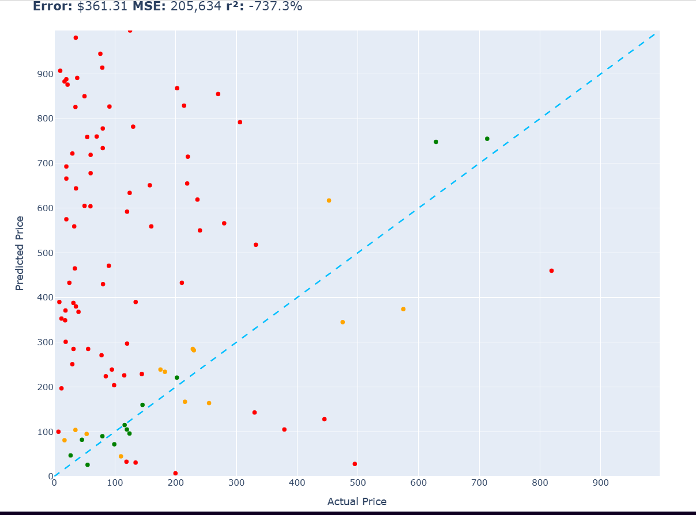
  

---

## 📌 Constant Price Baseline

The model always predicts a constant price.

| Metric | Result |
|---|---:|
| Absolute Price Error | 106.08 |
| R² | -0.1% |
<table>
  <tr>
    <td>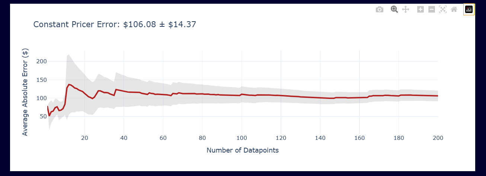</td>
    <td>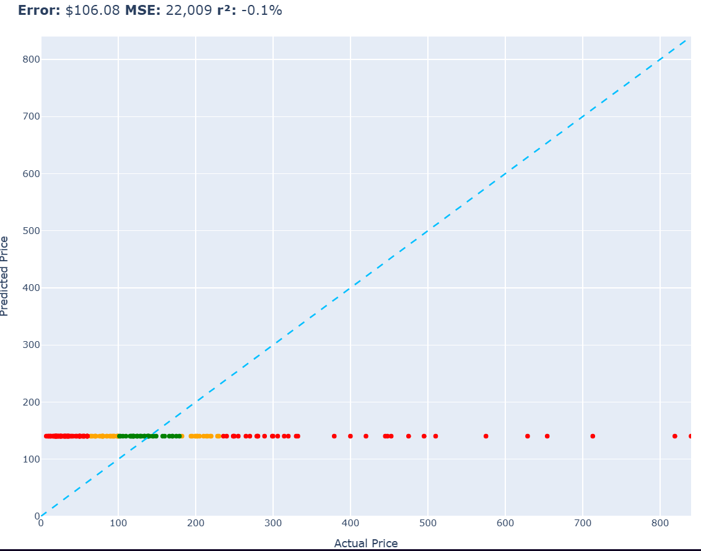</td>
  </tr>
</table>

# 🤖 Traditional Machine Learning Models

## 📐 Linear Regression

A basic linear regression model was used as an initial ML baseline.

| Metric | Result |
|---|---:|
| Absolute Price Error | 92.31 |
| R² | 17.1% |

### 📸 Photos — Linear Regression

<table>
  <tr>
    <td>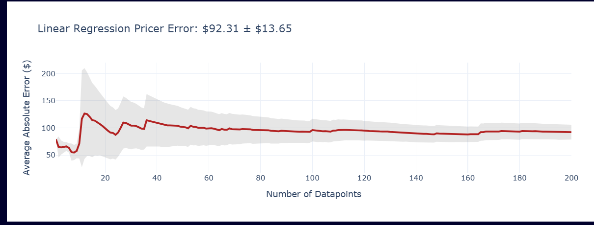</td>
    <td>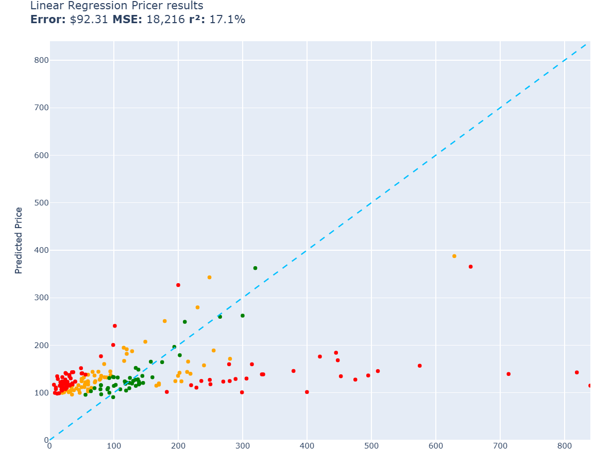</td>
  </tr>
</table>

## 📊 Linear Regression with 2,000 Features

A higher-dimensional feature representation using approximately 2,000 features was evaluated.

| Metric | Result |
|---|---:|
| Absolute Price Error | 79.67 |
| R² | 38.6% |

### 📸 Photos — Linear Regression (2,000 Features)
<table>
  <tr>
    <td>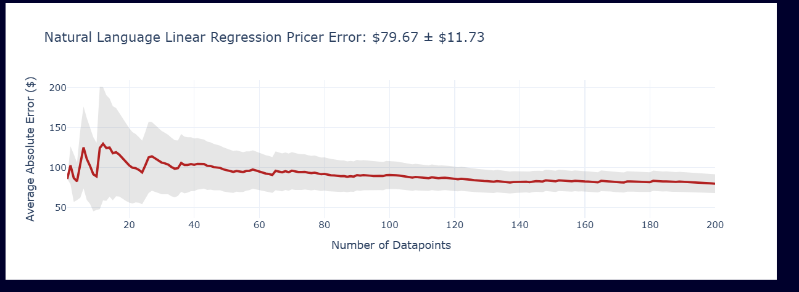</td>
    <td>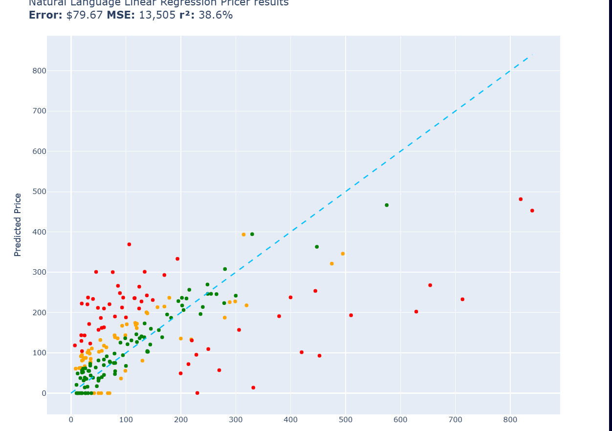</td>
  </tr>
</table>
---

## 🌲 Random Forest Regressor

A Random Forest regression model was trained to capture nonlinear relationships between product features and price.

| Metric | Result |
|---|---:|
| Absolute Price Error | 72.87 |
| R² | 42.5% |

<table>
  <tr>
    <td>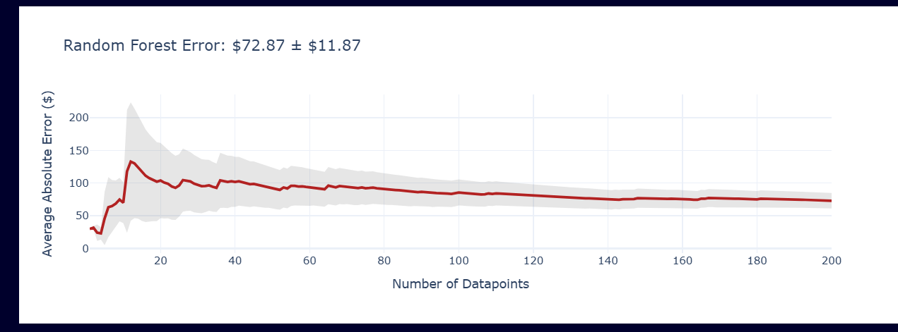</td>
    <td>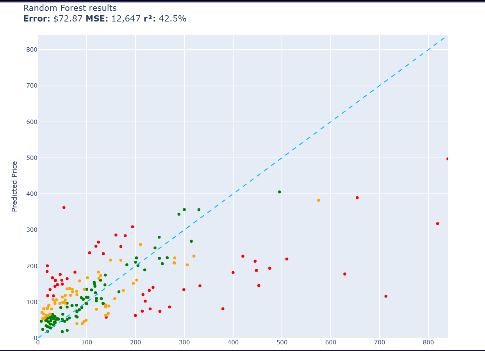</td>
  </tr>
</table>

---

## ⚡ XGBoost

XGBoost was evaluated as a gradient-boosted tree-based regression approach.

| Metric | Result |
|---|---:|
| Absolute Price Error | 76.63 |
| R² | 41.8% |

<table>
  <tr>
    <td></td>
    <td>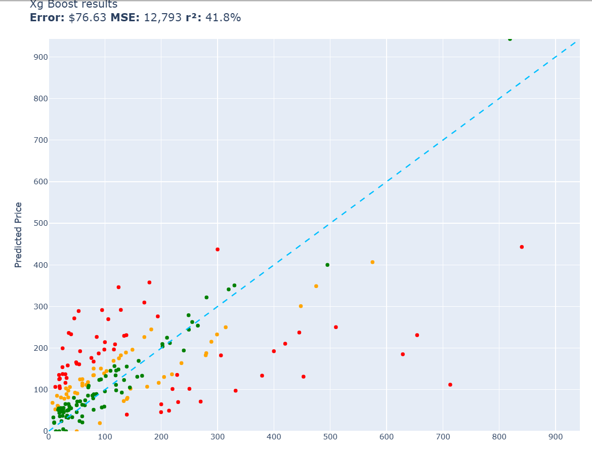</td>
  </tr>
</table>

---
## 🧠 Neural Network Regressor

A Neural Network was trained to learn the relationship between the product description features and the target product price.

The model uses a nonlinear function approximation approach, allowing it to learn more complex relationships between the input features and product prices.

| Metric | Result |
|---|---:|
| Absolute Price Error | — |
| MSE | — |
| R² | — |

### 📸 Results

<table>
  <tr>
    <td align="center">
      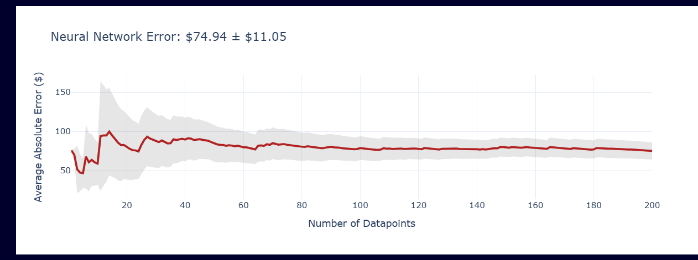<br>
      <b>Neural Network Model / Training</b>
    </td>
    <td align="center">
      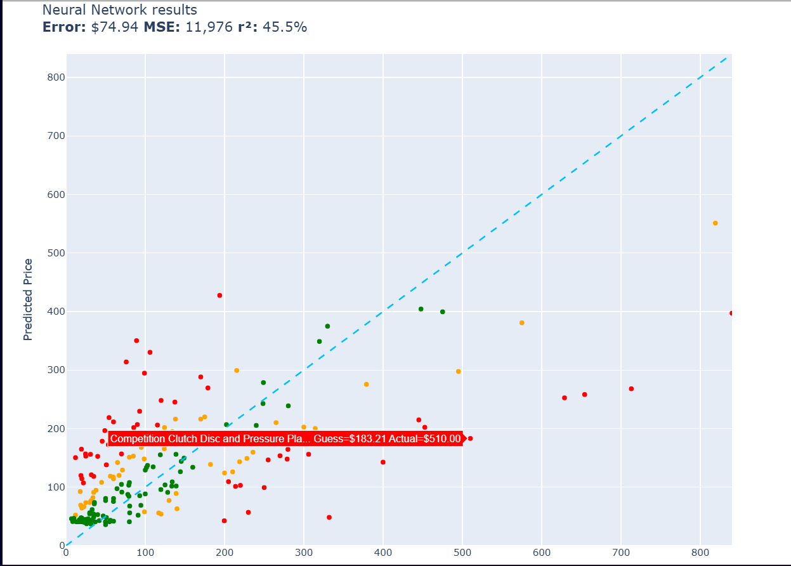<br>
      <b>Neural Network Evaluation</b>
    </td>
  </tr>
</table>

# Human made csv file by guessing the prices
guessing price only by short description of the item 

| Metric | Result |
|---|---:|
| Absolute Price Error | 76.63 |
| R² | 41.8% |

<table>
  <tr>
    <td>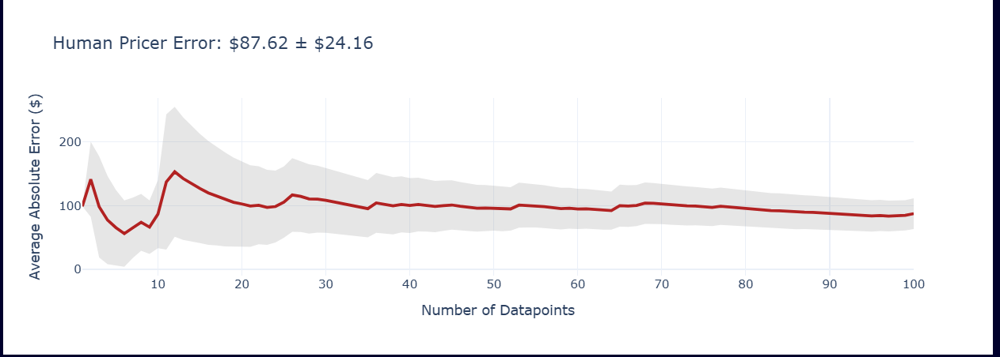</td>
    <td>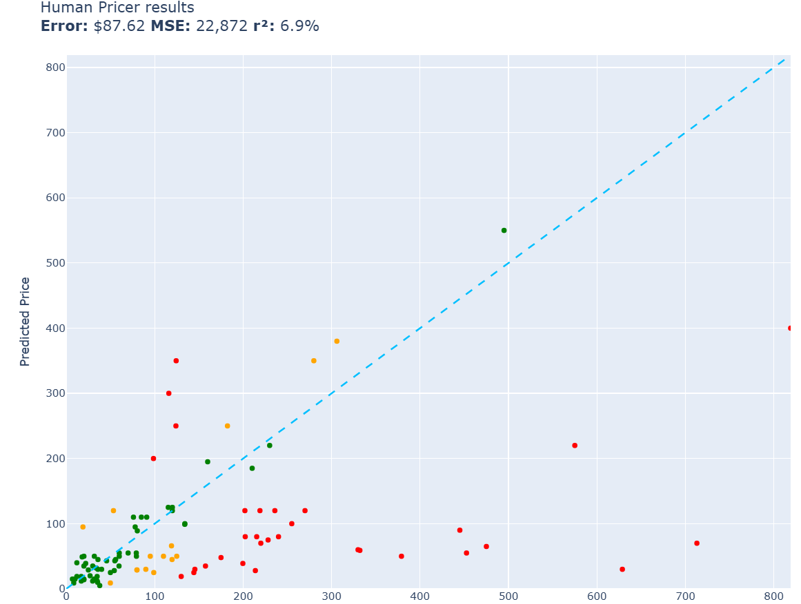</td>
  </tr>
</table>

---

# 🚀 Frontier Model Fine-Tuning

The project then moves beyond traditional ML models and explores fine-tuning frontier models.

The curated product dataset is transformed into a format suitable for supervised fine-tuning.

The preprocessing pipeline uses **GPT-OSS 20B via Grok in batch mode** to assist with processing the curated data.

---

### 📝 Fine-Tuning Dataset

The fine-tuning dataset is prepared in **JSONL format**.


## 🔬 Fine-Tuning with OpenAI

The OpenAI fine-tuning workflow consists of three major stages.

## 1. Create and Upload Training Data

Prepare the curated training data in JSONL format and upload it to the OpenAI platform.

```text
Curated Dataset
      ↓
Preprocessing
      ↓
JSONL
      ↓
Upload
```


## 2. Run the Fine-Tuning Job

Start the fine-tuning process using the selected OpenAI model.

The model learns from the curated examples during training.


## 3. Evaluate Training & Validation Loss

During training, monitor:

- Training loss
- Validation loss

Training loss should generally decrease as the model learns.

Validation loss is monitored to evaluate how well the model generalizes to validation examples.


# 🧠 OpenAI 4.1-Nano

The project also evaluates an **OpenAI Nano model** as part of the frontier-model experiments.

### Model

**OpenAI Nano**

### Task

Predict the price of a product from its description.

### Evaluation Metrics

- Absolute Price Difference
- R²

| Metric | Result |
|---|---:|
| Absolute Price Error | — |
| R² | — |

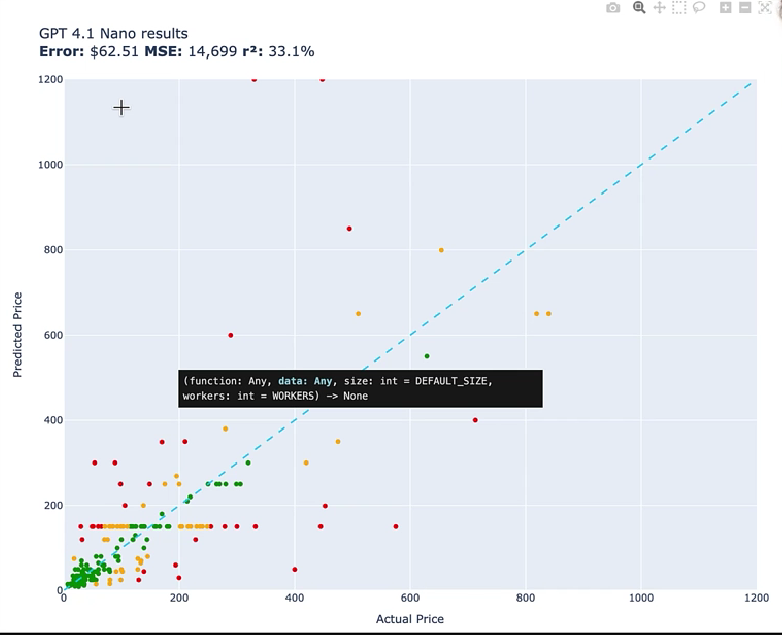


---


# 🤖 Future Agentic Application

The price prediction model is intended to become part of a larger **agentic solution**.

The eventual system could:

1. Receive a product
2. Analyze its description
3. Predict its expected price
4. Compare the predicted price with the listed price
5. Calculate the price difference
6. Evaluate the price information
7. Provide useful price information to the user

This transforms the model from a standalone predictor into a component of an intelligent shopping assistant.

---


# 📊 Final Results Table

The final table can be updated as additional frontier-model experiments are completed.

| Model | Absolute Price Error |  R² |
|---|---:|---:|
| Random Prediction | 361.31  | -737.3% |
| Constant Price | 106.08 | -0.1% |
| Linear Regression | 92.31 | 17.1% |
| Linear Regression — 2,000 Features | 79.67  | 38.6% |
| Random Forest Regressor | 72.87 | 42.5% |
| XGBoost | 76.63 | 41.8% |
| OpenAI Nano | 62.61 | 33.1% |

---

# 📌 Results Interpretation

The baseline experiments establish a reference point for the fine-tuned frontier models.

The traditional ML experiments provide progressively richer approaches to the price prediction problem, while the fine-tuning experiments investigate whether a frontier model can learn the relationship between product descriptions and prices from curated examples.

The final comparison will use the same evaluation metrics across models:

- **Absolute Price Difference**
- **MSE**
- **R²**

This provides a consistent framework for evaluating the different approaches.


---

##  Project Goal:

**Price is Right** explores how traditional machine learning and fine-tuned frontier models can be applied to a real-world commercial problem:

> **Estimating the price of a product from its description.**

The project combines **data engineering, traditional machine learning, frontier-model fine-tuning, evaluation, and productionization** into a single end-to-end workflow.
